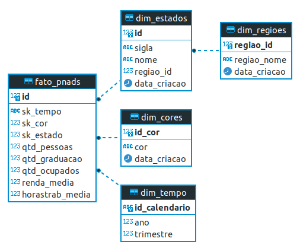
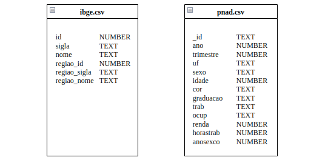
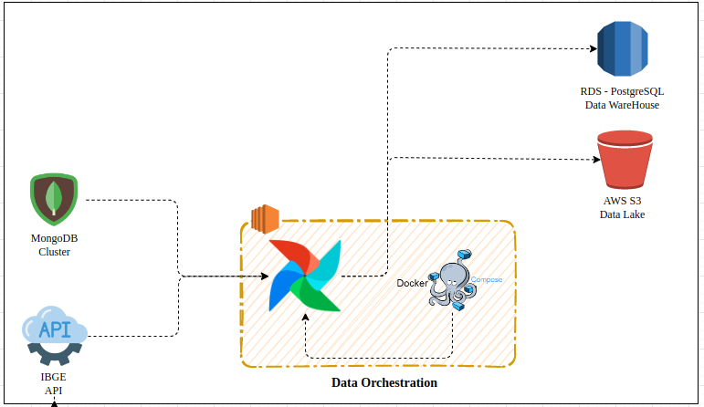
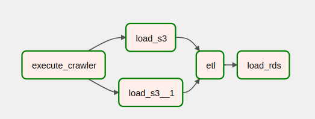

# Documentacao Projeto Pipeline de Dados

> Projeto pratico em modo de desafio com a criacao de um pipeline de dados completo desenvolvido como atividade avaliativa final do Bootcamp Engenheiro de Dados da XPEducacao.
## **Estrutura do Projeto**

    ├─ conf: pasta de configuracoes do projeto
    │  └─ config.yaml: arquivo de configuracao das variaveis do projeto
    ├─ dags: pasta de dags do Apache Airflow
    ├─ data: pasta auxiliar para armazenamento de dados durante a execucao das dags
    ├─ docs: pasta de documentacao do mkdocs
    │  └─ media
    │  └─ index.md: pagina inicial da documentacao do projeto
    ├─ logs: pasta de logs do Apache Airflow
    ├─ plugins: plugin do Apache Airflow
    ├─ mkdocs.yaml: arquivo de configuracao do mkdocs
    ├─ README.md
    ├─ docker-compose: arquivo para realizar o build dos containers docker do projeto


## **Objetivo do Projeto**

O pipeline foi criado a partir dos requisitos propostos pelo [desafio](media/desafio_xp.pdf).

O projeto extrai dados da **API** de regioes do IBGE e de um cluster **MongoDB** com os dados da PNAD 2020

Os dados em sua camada raw sao colocados em um bucket da **AWS S3** que servira como **Data Lake**.

Por fim, os dados sao filtrados e processados de acordo com as regras de negocio, modelados em formato dimensional e inseridos em um servidor **PostgreSQL** criado no **AWS RDS** e que servira como **Data Warehouse**.  

## **Modelo Multidimensional do Data Warehouse - SnowFlake**


## **Estrutura das tabelas do Data Lake**



## **Stack Tecnologica**

[Apache Airflow 2.0](https://airflow.apache.org/)  
[AWS RDS](https://aws.amazon.com/pt/rds/)  
[AWS S3](https://aws.amazon.com/pt/s3/)  
[Docker 20.10.17](https://www.docker.com/)  
[Python 3.10.7](https://www.python.org/)    

## **Decisoes Arquiteturais do Projeto**

O `Apache Airflow` e o orquestrador de pipelines mais utilizado do mercado, personalizavel e permite a escalabilidade do projeto com a possibilidade de processamento distribuido.  
O `AWS RDS` foi escolhido por ser uma solucao totalmente gerenciada, permitir a escolha de diferentes provedores de bancos de dados e escalabilidade. A engine `Postgres` e um dos bancos de dados mais populares do mundo, alem de ser um software livre e com documentacao muito completa.  
O `AWS S3` e muito utilizado no mercado pela sua flexibilidade e a possibilidade de consumo dos dados
em seu formato nativo. Alem disso e possivel separar o projeto em uma estrutura de pastas que auxilia o 
armazenamentos dos dados em todos os estagios do pipeline. Caracteristica essa muito importante para na criacao de Data Lakes.  
O `Docker` permite uma maior compatibilidade e flexibilidade no ambiente de execucao do projeto. Alem disso
pode ser implementado nao apenas em servidores como tambem em solucoes serverless disponiveis em todas as 
plataformas de cloud.    




## **Pipeline de Dados Apache Airflow**
  
1. **Task execute-crawler:** task responsavel por extrair os dados da pnad armazenados no cluster MongoDB e da api de regioes do IBGE.  
2. **Task load-s3** task responsavel por armazenar os dados da pnad extraidos do cluster MongoDB no s3. 
3. **Task load-s3-1:** task responsavel por enviar os dados da api do ibge para o s3 
4. **Task etl:** task responsavel por transformar os dados de acordo com o modelo dimensional definido. 
5. **Task load-rds:** task responsavel por carregar os dados no banco de dados. 
## **Como Executar este Projeto**

1. Crie uma instancia no `AWS EC2` ou outro provedor da sua escolha, realize o download deste repositorio e execute o docker-compose para realizar o build dos containers:  
```bash
docker-compose up -d
```  
2. Criar um bucket no `AWS S3` com o nome *data-lake-pnad*.  
3. Crie um servidor de banco de dados `PostgreSQL` utilizando a `AWS RDS`. Alem disso, crie o database `dw_pnad`.  
4. Adicione as credenciais de acesso da API e do cluster MongoDB no arquivo `./conf/config.yaml`.  
5. Adicione as credenciais da aws para acesso ao S3 e os dados de acesso ao banco de dados no arquivo `./conf/config.yaml`.  
6. Crie as tabelas no banco de dados executando os comandos do arquivo `databases.sql`.  
7. Executar o pipeline de dados no `Apache Airflow`.